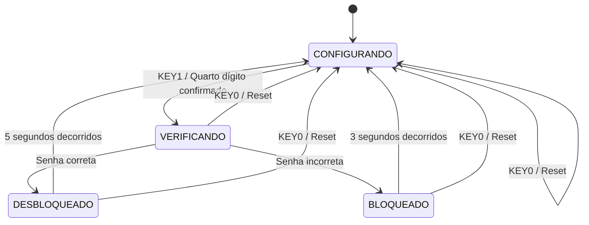

# Projeto-SD-SafeCrackPro

## Diagrama de Estados

```mermaid
stateDiagram-v2
    [*] --> CONFIGURANDO

    CONFIGURANDO --> VERIFICANDO: KEY1 / Quarto dígito confirmado

    VERIFICANDO --> DESBLOQUEADO: Senha correta
    VERIFICANDO --> BLOQUEADO: Senha incorreta

    DESBLOQUEADO --> CONFIGURANDO: 5 segundos decorridos
    BLOQUEADO --> CONFIGURANDO: 3 segundos decorridos

    CONFIGURANDO --> CONFIGURANDO: KEY0 / Reset
    VERIFICANDO --> CONFIGURANDO: KEY0 / Reset
    DESBLOQUEADO --> CONFIGURANDO: KEY0 / Reset
    BLOQUEADO --> CONFIGURANDO: KEY0 / Reset
```
# esse é o diagrama de estados professor victor me(i)deiros
